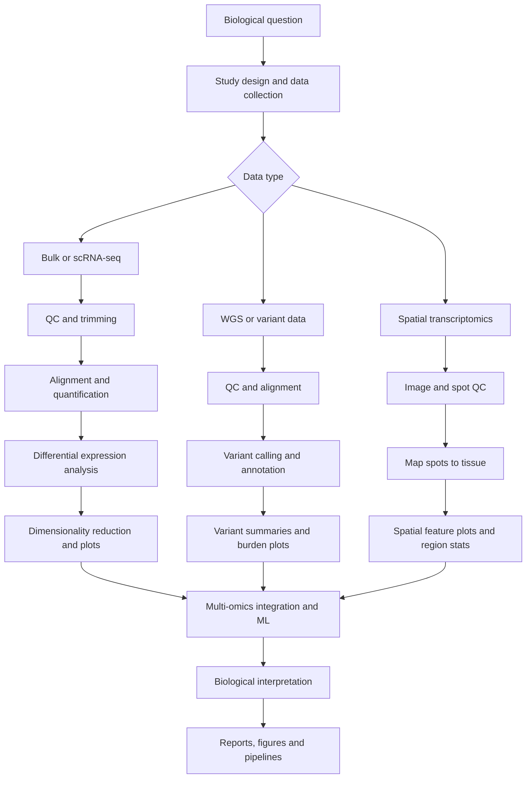

# Hi, I'm Ritupam Sarma 👋

I am a Bioinformatician and Demonstrator at the University of Glasgow with expertise in cancer genomics, infection biology, and computational genomics. I specialize in analyzing complex multi-omic datasets, including cutting-edge spatial transcriptomics, to uncover biological insights in cancer and infectious diseases.

## About Me

Learn more about my background, skills, and research on my [Online Portfolio](https://pawnchessmon.github.io/Introduction/).

- Proficient in NGS data analysis, variant filtering, and multi-omics integration using R, Python, and UNIX/Linux environments.
- Skilled in developing robust bioinformatics pipelines with Nextflow and managing HPC workflows.
- Experienced in spatial transcriptomics platforms such as 10x Genomics Visium, CosMx, and GeoMx DSP.
- Passionate about applying computational biology techniques to understand cancer progression, pathogen biology, and host–pathogen interactions.
- Interested in machine learning and deep learning applications in bioinformatics using PyTorch and TensorFlow.

## Technical Skills

- **Genomics & Transcriptomics:** RNA-seq (bulk & single-cell), WGS, GWAS, variant annotation, spatial transcriptomics
- **Programming & Tools:** R (Seurat, DESeq2), Python (scikit-learn, PyTorch), SQL, Git, Nextflow, UNIX/Linux
- **Data Analysis & Visualization:** ggplot2, Matplotlib, Seaborn, PCA, heatmaps, spatial feature plots
- **Molecular Visualization:** PyMOL, UCSF Chimera

## Research Highlights

- Investigated the role of chronic stress on lung cancer spatial transcriptomics.
- Developed pipelines for colorectal cancer liver metastasis multi-omic studies, identifying therapeutic targets.
- MSc project on Plasmodium falciparum gene family networks to reveal immune evasion mechanisms.

Feel free to explore my repositories for pipelines, analysis scripts, and projects related to cancer genomics, spatial transcriptomics, and infection biology.

## How I Work

___

📫 You can reach me at [ritupam.sarma@gmail.com](mailto:ritupam.sarma@gmail.com)  
🔗 Connect on [LinkedIn](https://www.linkedin.com/in/ritupam-sarma-44189b277/) | GitHub: [@PawnChessmon](https://github.com/PawnChessmon)  

